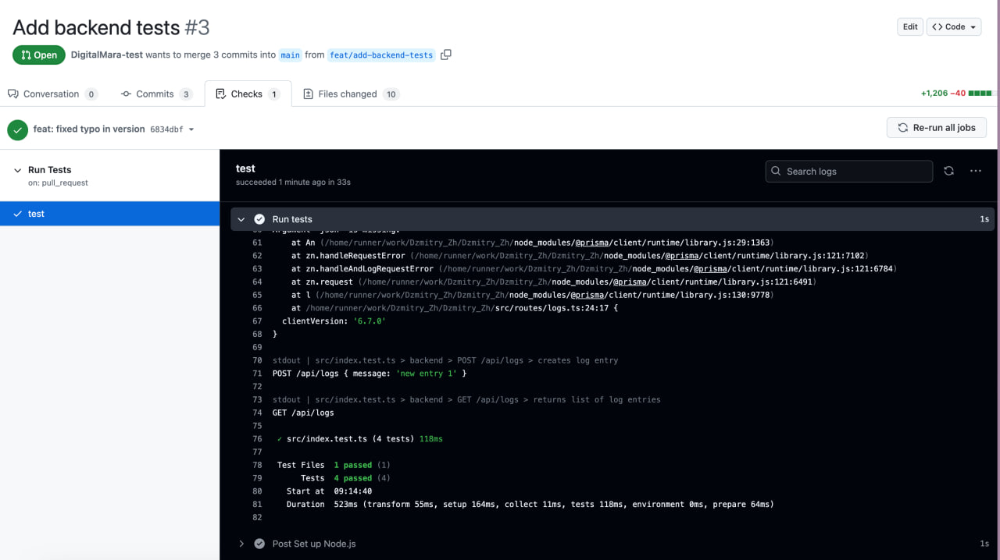

## How to run

Start postgres with docker-compose:

```bash
docker-compose up -d
```

To stop postgres:

```bash
docker-compose down
```

Copy `.env.example` to `.env`:

```bash
cp .env.example .env
```

Install modules and sync db schemas:

```bash
npm ci
npm run prisma:push
```

Run project:

```bash
npm run dev
```

## Task

Create a backend using TypeScript and a PostgreSQL database with one table named `log`.

### The exposed backend API must enable the insertion and listing of data.

Logs insertion example:

```bash
$ curl -X POST -H "Content-Type: application/json" http://localhost:3000/api/logs --data '{"message":"new entry 1"}'
{"id":"611d45ad-7319-4767-bb32-621a43753afd","inserted_at":"2025-05-09T09:21:50.000Z","json":{"message":"new entry 1"}}
```

Logs listing example:

```bash
$ curl http://localhost:3000/api/logs
[{"id":"c15bdbac-2425-43ee-a6e6-b9e07b815c42","inserted_at":"2025-05-09T09:05:59.000Z","json":{"message":"new entry 1"}}]
```

### The log table must have:

- an `id` column as the primary key
- an `inserted_at` column of type “timestamptz” with the default value: `now()`
- a `json` column of type `json`

All columns must have the `NOT NULL` constraint.

DB schema:

```
\d+
                                   List of relations
 Schema | Name | Type  | Owner | Persistence | Access method |    Size    | Description
--------+------+-------+-------+-------------+---------------+------------+-------------
 public | log  | table | user  | permanent   | heap          | 8192 bytes |
(1 row)

\d+ "log"

   Column    |            Type             | Collation | Nullable |      Default      | Storage  | Compression | Stats target | Description
-------------+-----------------------------+-----------+----------+-------------------+----------+-------------+--------------+-------------
 id          | text                        |           | not null |                   | extended |             |              |
 inserted_at | timestamp(0) with time zone |           | not null | CURRENT_TIMESTAMP | plain    |             |              |
 json        | jsonb                       |           | not null |                   | extended |             |              |
Indexes:
    "log_pkey" PRIMARY KEY, btree (id)
Access method: heap
```

Create a html page to show the data written to the database and a form to enter data.

### Create a CI pipeline to test the backend.

CI job example: https://github.com/DigitalMara-test/Dzmitry_Zh/actions/runs/14925615793/job/41929709491?pr=3



We expect that this assignment takes about 2-3 hrs to complete. Feel free to use any tools/environment you wish or are comfortable with to accomplish the task if not specifically mentioned otherwise.
